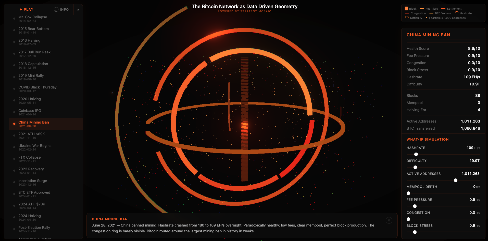

# The Bitcoin Network as Data Driven Geometry

An interactive 3D visualization of the Bitcoin network across 25 historically significant snapshot dates, from Genesis (January 2009) through the 2025 market correction. Every shape, ring, particle, and block maps to real on-chain data. Nothing is decorative.

**Real on-chain data · CoinMetrics + blockchain.com**



## What You're Looking At

### Center Spine — Blocks
Each cuboid is one real Bitcoin block mined that day. Width = block weight (wider = fuller block, up to 4 MWU). Brightness = transaction count (brighter gold/white = more transactions, dimmer amber = fewer). Hover to highlight individual blocks at 2.5x scale. Click to pin and inspect.

### Horizontal Rings — Transaction Metrics
- **Fee Tiers** (r=2.2): Four arc segments showing fee distribution across sat/vB tiers. Thickness scales with fee pressure.
- **Settlement** (r=2.8): Arc length represents block production health. Full circle = blocks arriving on schedule. Shrinks under stress.
- **Congestion** (r=3.3): Red arc. Length and intensity scale with network congestion score. Barely visible when mempool is clear, expands during heavy load.
- **BTC Volume** (r=3.8): Gold arc proportional to daily BTC transferred relative to the 4.6M BTC/day peak (2021 ATH, Glassnode-style raw transfer methodology).

### Vertical Rings — Security Metrics
- **Hashrate** (YZ plane, r=2.5): Arc proportional to network hashrate vs ~1,305 EH/s peak. Grows from invisible at Genesis to nearly full circle at peak security.
- **Difficulty** (XZ plane, r=3.0): Log-scaled arc representing mining difficulty (1 to 150 trillion). Adjusts every 2,016 blocks.

### Floating Particles — Active Addresses
Each particle represents ~1,000 unique active addresses on that day. Genesis = zero particles. Bull market peaks = over 1,000 glowing dots. Larger particles indicate whale activity (outputs over 100 BTC).

## Data Sources

Each metric comes from the most authoritative free public source for that specific field:

| Field | Source | Notes |
|---|---|---|
| `activeAddresses` | **CoinMetrics** `AdrActCnt` | Gold-standard on-chain provider used by Bloomberg, CoinDesk, academic researchers |
| `networkHashrateEh` | **CoinMetrics** `HashRate` | Single-source consistency |
| `totalFeesBtc` | **CoinMetrics** `FeeTotNtv` | Reliable, matches blockchain.com closely |
| `avgBlockIntervalSeconds` | derived from CoinMetrics `BlkCnt` (86400/N) | Real per-day blocks count |
| `blockProductionStress` | derived from interval ratio to 600s | Healthy = ~0.7-0.9, congested = >1.5 |
| `difficulty` | **blockchain.com** `/charts/difficulty` | CoinMetrics community tier doesn't expose `DiffMean` |
| `btcTransferred` | original BigQuery extract | Matches Glassnode "Transfer Volume" methodology (raw on-chain throughput, includes change outputs). blockchain.com's "estimated" filter is too aggressive and reports ~10× lower numbers |
| `mempoolTxCount` / `mempoolSizeMb` | **blockchain.com** | Best free historical mempool source |
| Per-block spine data | Google BigQuery `crypto_bitcoin` | Block height, size, weight, tx count |

The data is re-fetched and patched in place via `scripts/patch_coinmetrics.mjs`, which is idempotent and re-runnable. An audit script (`scripts/audit_data.mjs`) cross-checks every numeric field against the public sources.

### Why Hashrate Varies Across Sources

Bitcoin hashrate cannot be measured directly — it's always estimated from observed block production and difficulty. Different sources publish different values for the same day depending on smoothing window. Day-to-day "instantaneous" hashrate can swing ±15% from random block-timing variance. We use CoinMetrics' methodology, which is the standard most analysts and news outlets cite.

## Features

- **25 Historical Snapshots**: Genesis Era, Pizza Day, 2011 Bubble, Mt. Gox Collapse, halvings, bull runs, COVID crash, Trump inauguration, and more
- **6 What-If Sliders**: Hashrate, Difficulty, Active Addresses, Fee Pressure, Congestion, Block Stress — each maps to a distinct visual element
- **Click-to-Pin**: Click any shape to freeze the scene. KPIs lock, rotation and playback pause. Adjust What-If sliders freely. Click again (or empty space) to resume with prior state restored.
- **Animated Transitions**: Ring parameters smoothly lerp between snapshots (~3s). Blocks fade in. Particles adjust count.
- **Ambient Rotation**: Slow orbital rotation (~78s per revolution) with toggle control. Full 360° manual orbit via drag (no polar constraints).
- **Per-Snapshot Narration**: Historical context appears as a narration bubble for each event
- **Interactive Legend**: Inside the Info modal as a tab. Lists every shape with icon + description.
- **Mobile-First**: Collapsible bottom sheet, swipe-up gesture, horizontal timeline strip with auto-scroll, two-stage grid selection

## Visual Effects

- Bloom with mipmap blur (desktop only — disabled on mobile to avoid iOS half-float precision overflow)
- Subtle chromatic aberration (desktop only)
- Vignette (cinematic edge darkening)
- Beveled arc geometry for ring depth
- Cinematic 4-point lighting (key, fill, rim, core)
- Health-driven core light pulse
- Full retina rendering (DPR 2x)

## Tech Stack

- **React 19** + **TypeScript 5.9**
- **React Three Fiber 9** (Three.js declarative)
- **drei 10** (TrackballControls for full 360° orbit)
- **postprocessing** (Bloom, Vignette, ChromaticAberration)
- **Vite 7** (build tooling)
- **Cloudflare Pages** (deployment)

## Run Locally

```bash
npm install
npm run dev
```

## Build & Deploy

```bash
# Production build
npm run build

# Deploy to Cloudflare Pages
npx wrangler pages deploy dist --project-name=bitcoin-data-driven-geometry

# Or serve locally
npx serve dist
```

## Refresh Data

The data tables in `src/data/mosaicSnapshots.ts` can be re-fetched at any time:

```bash
# Pull fresh values from CoinMetrics + blockchain.com and patch in place
node scripts/patch_coinmetrics.mjs

# Preview changes without writing
node scripts/patch_coinmetrics.mjs --dry

# Audit current values against public sources
node scripts/audit_data.mjs
```

## Design Principles

1. **Every shape = real data** — No decorative geometry. If it renders, it maps to a verified metric.
2. **Honest granularity** — Don't subdivide beyond the data. Don't interpolate where there are no values.
3. **Source transparency** — Every field has a documented source listed in the Info modal so users can audit.
4. **Orange/amber palette only** — Brand consistency across all visual elements.
5. **Elegant, Accurate, Usable, Insightful, Immersive** — The five pillars guiding every design decision.

## What This Is Not

- Not price prediction or trading signals
- Not investment advice
- Not a real-time feed (historical snapshots only)
- Not decorative data art — every pixel traces to a number

## Project Structure

```
src/
  App.tsx                — Full application (~1700 lines): 3D scene, UI panels, narration
  types.ts               — NetworkSnapshot type with all data fields
  styles.css             — Complete styling with mobile responsive breakpoints
  data/
    blockData.ts         — Per-block arrays for all 25 dates (from BigQuery)
    mosaicSnapshots.ts   — 25 snapshots with network metrics + on-chain data
scripts/
  patch_coinmetrics.mjs  — Canonical patcher (CoinMetrics + blockchain.com)
  audit_data.mjs         — Read-only audit against public sources
  patch_mosaic.mjs       — (legacy) Hashrate/difficulty patcher
  patch_gbq.mjs          — (legacy) On-chain field patcher
  refetch_metrics.mjs    — Ad-hoc metric printer
```
